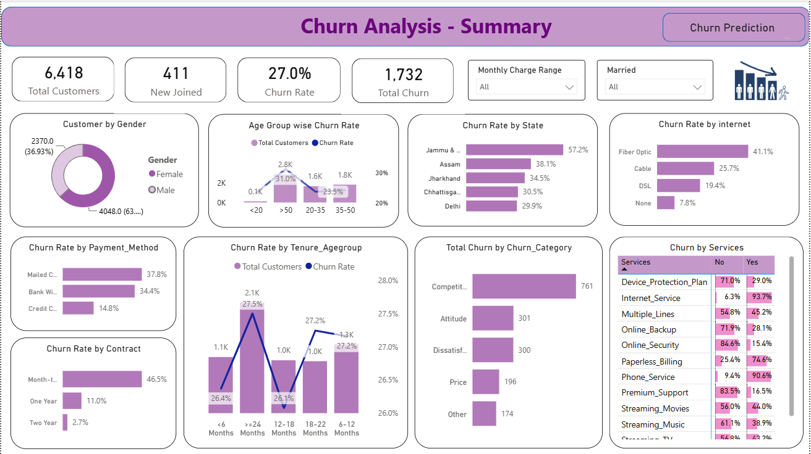
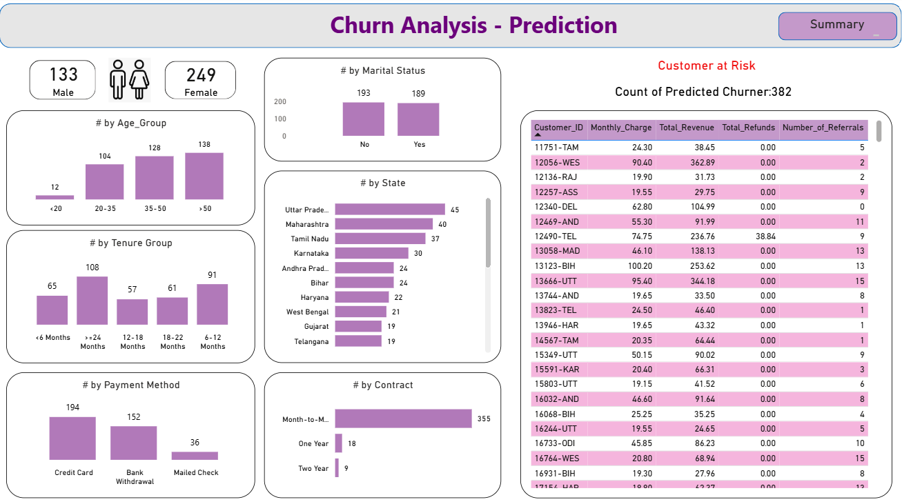

# 📊 Customer Churn Analysis & Prediction

## 📌 Project Overview
This project focuses on analyzing customer behavior and predicting customer churn using Machine Learning. The objective is to identify customers who are likely to leave the company, enabling businesses to take proactive retention measures.
The project combines **SQL Server**, **Python**, **Power BI**, and **Machine Learning** to build an end-to-end analytics solution.

## 🎯 Objectives

- Analyze customer churn patterns.
- Identify factors contributing to customer churn.
- Build an interactive dashboard for business insights.
- Predict future churners using Machine Learning.
- Support customer retention strategies.

## 🛠 Technologies Used

- SQL Server
- Python
- Power BI
- Advanced Excel
- Pandas
- NumPy
- Scikit-learn
- Decision Tree Classifier
- Matplotlib
- Jupyter Notebook

## 📊 Dashboard Features

### 📈 Page 1: Customer Churn Analysis (Summary)
This page provides a comprehensive overview of customer churn using historical data and business KPIs.

**Key Features:**
- KPI Cards: Total Customers, New Customers, Churn Rate, and Total Churn
- Customer Distribution by Gender
- Churn Rate by Age Group
- Churn Rate by State
- Churn Rate by Internet Service
- Churn Rate by Payment Method
- Churn Rate by Contract Type
- Churn Rate by Customer Tenure
- Total Churn by Churn Category
- Churn Analysis by Services (Internet, Security, Backup, Streaming, etc.)
- Interactive slicers for Monthly Charge Range and Marital Status
- Dynamic filtering for detailed business analysis

### 🤖 Page 2: Customer Churn Prediction
This page presents customers predicted to churn using a **Decision Tree Machine Learning model**.

**Key Features:**
- Predicted Churn Customer Count
- Customer Distribution by Gender
- Predicted Customers by Age Group
- Predicted Customers by Marital Status
- Predicted Customers by State
- Predicted Customers by Tenure Group
- Predicted Customers by Payment Method
- Predicted Customers by Contract Type
- Detailed Customer-at-Risk table showing:
  - Customer ID
  - Monthly Charges
  - Total Revenue
  - Total Refunds
  - Number of Referrals
- Interactive visuals for identifying high-risk customers and supporting customer retention strategies

## 🤖 Machine Learning
### Algorithm Used
- Decision Tree Classifier

### Model Workflow
- Data Preprocessing
- Feature Encoding
- Train-Test Split
- Model Training
- Prediction
- Model Evaluation

## 📈 Business Insights
- Identified high-risk customers likely to churn.
- Compared churn across contract types and payment methods.
- Analyzed customer demographics and service usage.
- Visualized KPIs to support retention strategies.
- Generated churn predictions for proactive decision-making.

## 📷 Dashboard Preview

